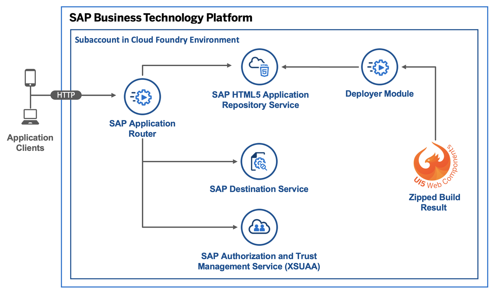
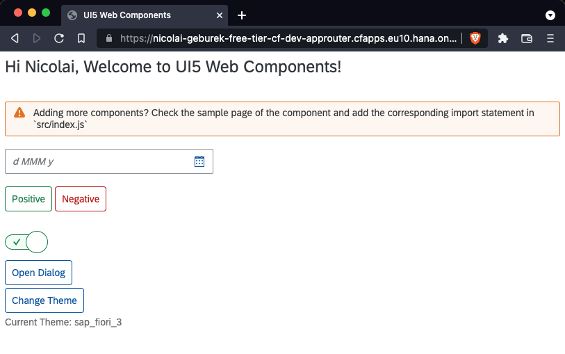

# Standalone Application Router, Using HTML5 Application Repository with UI5 Web Components, XSUAA Service, and Destination Service 

## Diagram



## Description
This is an example of an HTML5 app built with UI5 Web Components that you maintain on a standalone application router in your own space in the Cloud Foundry environment. The app is deployed to the HTML5 Application Repository and uses the Authentication & Authorization service (XSUAA service), the destination service, and the User API service.


## Download and Installation
1. Download the source code:
    ```
    git clone https://github.com/SAP-samples/multi-cloud-html5-apps-samples
    cd multi-cloud-html5-apps-samples/standalone-approuter-html5-mta-ui5webcomponents
    ```
2. Build the project:
    ```
    npm install
    npm run build
    ```
3. Deploy the project:
    ```
    cf deploy mta_archives/standalone-approuter-ui5webcomponents_1.0.0.mtar
    ```

If the deployment has been successful, you find the URL of the application router in the console output or you can print it on Unix-based systems with `cf app approuter | awk '/^routes/ { print "https://"$2"/" }'`. It probably has the following structure: <https://[cf-org-name]-dev-approuter.cfapps.eu10.hana.ondemand.com>.


## Configuration

You can replace the content of the `ui5webcomponents` folder with your own HTML5 app. Please note that the `html5deployer` expects a zipped version of your build result (in our case the build result is our `dist` folder). Check the build script at [`package.json`](ui5webcomponents/package.json) to see an example of that. Keep in mind that your app id in the `manifest.json` has to match the target for path `^(.*)` (all incoming requests) in the [`xs-app.json`](approuter/xs-app.json).

## Check the Result

### List the Deployed HTML5 App

```
$ cf html5-list                                     
Getting list of HTML5 applications in org [cf-org-name] / space dev as firstname.lastname@domain.com...
OK

name               version   app-host-id                            service instance   visibility   last changed   
ui5webcomponents   1.0.0     1db2ae23-90e9-4055-a22c-6865ca7ad73e   html5_repo_host    public       Mon, 10 Aug 2020 13:26:03 GMT   
```

### List the Deployed MTA

```
$ cf mta standalone-approuter-ui5webcomponents_1.0.0.mtar
Showing health and status for multi-target app standalone-approuter-ui5webcomponents_1.0.0.mtar in org [cf-org-name] / space dev as firstname.lastname@domain.com...
OK
Version: 1.0.0

Apps:
name               requested state   instances   memory   disk   urls   
approuter   started           1/1         256M     256M   [cf-org-name]-dev-approuter.cfapps.eu10.hana.ondemand.com

Services:
name                 service           plan          bound apps         last operation   
html5_destination    destination       lite          approuter          create succeeded   
html5_repo_host      html5-apps-repo   app-host                         create succeeded   
html5_repo_runtime   html5-apps-repo   app-runtime   approuter          create succeeded   
html5_uaa            xsuaa             application   approuter          create succeeded   
```

### Check the Web App

Access the URL to view the web app. You are directed to a sign-on page before you can see the web app that displays your name.




## BTP Destination Certification (Oauth Client 생성 시 사용)
* BTP Cockpit > Connectivity > Destination 접속
* Download Trust


좋습니다! OData를 기반으로 **SuccessFactors Employee Central Payroll(ECP)** 시스템의 데이터를 활용해 **애플리케이션을 개발**하고자 하는 목적이라면, 다음과 같은 구조로 **기본부터 심화까지 단계적으로** 접근하는 것이 효과적입니다.

---

# 📘 OData를 활용한 SAP ECP 애플리케이션 개발 가이드

---

## 1️⃣ **기초 개념 이해: OData란?**

### 🔹 OData (Open Data Protocol)
- RESTful API 기반의 SAP 표준 데이터 서비스
- URL을 통해 **Entity**(데이터 단위) 접근 가능
- SAP Gateway 기반 ERP 시스템에서 쉽게 사용 가능

### 🔹 SAP OData의 기본 구조
```
GET /sap/opu/odata/sap/<서비스명>/<EntitySet>
```
예:
```
GET /sap/opu/odata/sap/PAOM_MASTERDATA_SRV/EmployeeCollection
```

---

## 2️⃣ **환경 준비: SAP Gateway 설정**

| 항목 | 트랜잭션 코드 | 설명 |
|------|---------------|------|
| 서비스 활성화 | `/IWFND/MAINT_SERVICE` | OData 서비스 추가 및 활성화 |
| 서비스 등록 | `/IWBEP/REG_SERVICE` | Backend에서 서비스 등록 |
| 테스트 클라이언트 | `/IWFND/GW_CLIENT` | OData 요청 테스트 |
| 메타데이터 확인 | `<service>/$metadata` | Entity 구조 및 필드 확인 가능 |

✅ _Tip: JSON 응답을 원할 경우_ → `?$format=json` 추가

---

## 3️⃣ **실제 활용 예: 표준 서비스 분석**

### ▶ `/IWFND/PAOM_MASTERDATA_SRV` 예시
- **URL**: `/sap/opu/odata/sap/PAOM_MASTERDATA_SRV/EmployeeCollection`
- **기본 쿼리 예**
```http
GET /sap/opu/odata/sap/PAOM_MASTERDATA_SRV/EmployeeCollection?$top=10&$format=json
```

### ▶ 필터링 / 정렬
```http
GET /EmployeeCollection?$filter=PersonnelNumber eq '12345'
GET /EmployeeCollection?$orderby=LastName desc
```

---

## 4️⃣ **OData를 효율적으로 consume하는 팁**

### 🔹 필터링, 정렬, 페이징
- `$filter`, `$orderby`, `$top`, `$skip` 등의 OData Query Option 사용
- 성능 및 사용자 UX를 위한 **서버 사이드 처리**에 유리

### 🔹 확장성 고려
- SAP에서는 표준 서비스를 `SEGW`를 통해 **확장(Enhance)** 가능
- 커스텀 필드 추가 시 메타데이터(`/metadata`) 자동 갱신

### 🔹 인증 처리
- ERP의 경우 SAML/OAuth/Basic 인증 방식 사용 가능
- 개발환경에서는 Postman이나 local backend에서 **Basic Auth** 자주 활용

---

## 5️⃣ **프론트엔드 연동 전략**

### 예: React 앱에서 사용
```ts
const res = await fetch(
  '/sap/opu/odata/sap/PAOM_MASTERDATA_SRV/EmployeeCollection?$top=5&$format=json',
  {
    headers: {
      Authorization: 'Basic ...',
      Accept: 'application/json',
    },
  }
);
const data = await res.json();
```

### SAPUI5 (Fiori) 사용 시
```xml
<Table items="{ path: '/EmployeeCollection' }">
  <columns>
    <Column><Text text="이름" /></Column>
  </columns>
  <items>
    <ColumnListItem>
      <cells>
        <Text text="{LastName}" />
      </cells>
    </ColumnListItem>
  </items>
</Table>
```

---

## 6️⃣ **심화 주제: 성능 최적화 및 데이터 모델링**

| 주제 | 설명 |
|------|------|
| `$expand` | 관계형 Entity를 한 번에 불러오기 (예: 주소 포함) |
| `$select` | 필요한 필드만 조회 (네트워크 부하 감소) |
| `$batch` | 여러 요청을 한 번에 전송 (성능 개선) |
| `ETag` 활용 | 변경된 데이터만 전송하여 동기화 효율화 |
| Delta Token | 변경 추적을 위한 증분 데이터 처리 |

---

## 7️⃣ **개발 시 추천 도구**

| 도구 | 목적 |
|------|------|
| Postman | OData API 테스트 |
| SAP Business Application Studio (BAS) | SAP 공식 개발환경 |
| SAPUI5 SDK | 프론트엔드 OData 바인딩 예제 풍부 |
| Fiori Elements | 자동화된 List/Detail 화면 생성 (OData 기반) |

---

## 🔚 결론: OData 중심 개발은 "Entity 중심 + URL 기반의 RESTful 접근"이 핵심

- `서비스 등록 → 메타데이터 확인 → 쿼리 작성 → 인증 처리 → 프론트 연동` 순으로 접근
- 표준 OData에서 시작하되, 확장이 필요한 경우 SEGW에서 커스텀 필드 및 로직 개발 가능
- 개발자는 OData Entity, Metadata 구조 이해가 가장 중요함

---

## 1️⃣ 서비스별 실제 호출 예제: EmployeeCollection (확장 포함)

### 🔹 서비스명: `/IWFND/PAOM_MASTERDATA_SRV`
이 서비스는 Employee Central Payroll에서 HR Master Data에 접근하기 위한 표준 OData 서비스입니다.

#### ✅ 기본 호출
```http
GET /sap/opu/odata/sap/PAOM_MASTERDATA_SRV/EmployeeCollection?$format=json
```

#### ✅ 특정 직원 조회
```http
GET /sap/opu/odata/sap/PAOM_MASTERDATA_SRV/EmployeeCollection?$filter=PersonnelNumber eq '123456'&$format=json
```

#### ✅ 확장 필드 포함 (`$select`)
예를 들어 커스텀 필드 `Z_PositionText`를 추가했다고 가정할 때:
```http
GET /EmployeeCollection?$select=PersonnelNumber,FirstName,LastName,Z_PositionText&$format=json
```

#### ✅ 관계 Entity 확장 (`$expand`)
직원의 주소 정보를 포함해 가져올 때:
```http
GET /EmployeeCollection?$expand=EmployeeAddressNav&$format=json
```

> 🔍 관계 이름은 `$metadata` 파일에서 확인 가능 (브라우저에서 `/PAOM_MASTERDATA_SRV/$metadata` 열어보세요)

---

## 2️⃣ 개발 시 인증 방식 및 CORS 문제 해결

### 🔐 인증 방식

| 방식 | 설명 | 사용 예 |
|------|------|---------|
| Basic Auth | 테스트 및 내부용 | Postman, Local |
| SAML 2.0 | 웹 싱글사인온 (SSO) | SAP Cloud 환경 |
| OAuth 2.0 | 앱 기반 인증 | SAP BTP + XSUAA |

#### 🔑 로컬 개발 시 Basic Auth 예시
```ts
fetch('https://<host>/sap/opu/odata/sap/PAOM_MASTERDATA_SRV/EmployeeCollection', {
  headers: {
    'Authorization': 'Basic ' + btoa('USERNAME:PASSWORD'),
    'Accept': 'application/json',
  },
});
```

### 🌐 CORS 문제 해결 방법

#### 🔹 1. SAP App Router 사용 (권장)
- XSUAA 연결을 통해 자동으로 OAuth 및 CORS 문제 해결
- `xs-app.json`에 route 설정

```json
{
  "source": "^/odata/(.*)$",
  "target": "/sap/opu/odata/sap/$1",
  "destination": "ECP_BACKEND",
  "authenticationType": "xsuaa"
}
```

#### 🔹 2. Local Proxy 설정 (dev 중)
- `package.json`에서 `proxy` 설정
```json
"proxy": "http://<your-backend>:443"
```

---

## 3️⃣ SAPUI5 / Fiori Elements 예제 포함된 샘플 앱 구조

### 💡 예: 직원 리스트 및 상세정보 앱

#### 🔸 `manifest.json` 설정
```json
{
  "sap.app": {
    "dataSources": {
      "employee": {
        "uri": "/sap/opu/odata/sap/PAOM_MASTERDATA_SRV/",
        "type": "OData",
        "settings": {
          "odataVersion": "2.0"
        }
      }
    }
  },
  "sap.ui5": {
    "models": {
      "": {
        "dataSource": "employee",
        "settings": {
          "defaultBindingMode": "TwoWay"
        }
      }
    }
  }
}
```

#### 🔸 `List.view.xml` (직원 목록)
```xml
<Table items="{/EmployeeCollection}">
  <columns>
    <Column><Text text="사번" /></Column>
    <Column><Text text="이름" /></Column>
  </columns>
  <items>
    <ColumnListItem press="onSelect">
      <cells>
        <Text text="{PersonnelNumber}" />
        <Text text="{LastName}" />
      </cells>
    </ColumnListItem>
  </items>
</Table>
```

#### 🔸 `Detail.view.xml` (상세보기)
```xml
<ObjectHeader title="{LastName}" number="{PersonnelNumber}" />
<SimpleForm editable="false">
  <Label text="이메일" />
  <Text text="{Email}" />
  <Label text="주소" />
  <Text text="{EmployeeAddressNav/City}" />
</SimpleForm>
```

#### 🔸 Controller에서 직원 선택 시 상세보기 네비게이션
```js
onSelect: function (oEvent) {
  var sPath = oEvent.getSource().getBindingContext().getPath();
  this.getRouter().navTo("detail", {
    employeePath: encodeURIComponent(sPath)
  });
}
```

---

## 🔚 마무리 요약

| 항목 | 내용 |
|------|------|
| ✔️ 표준 서비스 | `/PAOM_MASTERDATA_SRV`로 직원 정보 조회 |
| 🔐 인증 방식 | OAuth2 + XSUAA 또는 Basic (dev용) |
| 🛠️ CORS 문제 | AppRouter 또는 proxy 설정으로 해결 |
| 🧩 SAPUI5/Fiori 앱 | `manifest.json` + `view.xml` 구성 |
| 🔍 필수 팁 | `$metadata` 확인하여 확장 필드, 관계 Entity 파악 |


# ECP OData 인증
**SAP BTP Destination + OAuth2SAMLBearerAssertion** 방식으로 구성하면, **BTP 앱에 로그인한 사용자 정보(SAML 인증)를 ECP 시스템으로 전달**하고, **ECP 내 사용자 권한에 따라 OData 결과를 제한**할 수 있습니다.

---

## ✅ 1. 전체 구성 개요

```
[BTP User] 
   ↓ (XSUAA SAML)
[App Router / UI5 앱]
   ↓ (OAuth2SAMLBearerAssertion)
[Destination 서비스]
   ↓ (SAML Bearer Token)
[ECP OData 서비스 (PAOM_MASTERDATA_SRV 등)]
```

---

## 🛠️ 2. SAP ECP (ERP 백엔드)에서 SAML OAuth2 클라이언트 구성

### 📍 전제 조건
- SAP NetWeaver ≥ 7.5 이상
- T-Code: **`SOAMANAGER`** 접근 가능

### 🔹 단계별 설정

#### ① OAuth2 클라이언트 등록 (T-Code: **`SOAMANAGER`**)
1. 메뉴: **Configuration → OAuth 2.0** → "Client Profile" 탭
2. 새 클라이언트 추가
   - **Client ID**: `BTP_APP` (원하는 이름)
   - **Grant Type**: `SAML 2.0 Bearer`
   - **Audience**: `SAP NetWeaver`
   - **Assertion Issuer**: 나중에 BTP XSUAA의 `clientid`와 일치시켜야 함
   - **SAML Assertion Recipient URL**: 자동 설정됨
   - **User Mapping**: `NameID to SAP User` (SAML NameID와 SAP 사용자 ID가 일치해야 함)

#### ② HTTPS 활성화 및 인증서 업로드
- BTP XSUAA에서 발급한 SAML 인증서의 **Signing Certificate**을 ECP에 등록
- 인증서 업로드 위치:
  - SOAMANAGER > "Trusted Identity Provider" (or STRUST 사용)

#### ③ SICF 서비스 활성화
```txt
/sap/opu/odata/sap/PAOM_MASTERDATA_SRV/
/sap/bc/sec/oauth2
```

---

## 🔧 3. BTP XSUAA 및 Destination 서비스 구성

### 🔹 ① xs-security.json 예시
```json
{
  "xsappname": "employee-app",
  "tenant-mode": "dedicated",
  "scopes": [
    { "name": "$XSAPPNAME.user", "description": "User Scope" }
  ],
  "role-templates": [
    {
      "name": "User",
      "description": "Standard User",
      "scope-references": ["$XSAPPNAME.user"]
    }
  ],
  "oauth2-configuration": {
    "redirect-uris": [
      "https://<your-app>.cfapps.<region>.hana.ondemand.com/**"
    ]
  }
}
```

### 🔹 ② Destination 설정 (SAP BTP Cockpit)

1. BTP Subaccount > **Connectivity → Destinations → New Destination**
2. 필드 입력:

| 항목 | 값 |
|------|----|
| **Name** | `ECP_BACKEND` |
| **Type** | HTTP |
| **URL** | `https://<your-ecp-host>` (e.g., `https://ecp.example.com`) |
| **Proxy Type** | Internet |
| **Authentication** | **OAuth2SAMLBearerAssertion** |
| **Token Service URL Type** | Dedicated |
| **Token Service URL** | `https://<your-ecp-host>/sap/bc/sec/oauth2/token` |
| **Audience** | `SAP NetWeaver` (SOAMANAGER에서 등록한 값과 동일) |
| **Client ID** | BTP에서 발급한 XSUAA의 Client ID |
| **Client Secret** | BTP에서 발급한 Client Secret |

📌 추가 Properties:
```txt
HTML5.DynamicDestination = true
WebIDEEnabled = true
WebIDEUsage = odata_gen
```

---

## 👥 4. 사용자 매핑 및 Propagation

- BTP 사용자와 ECP 사용자가 동일한 ID일 때, **NameID = SU01 User ID**
- XSUAA 설정에 따라 SAML Assertion이 자동 생성됨
- 실제 로그인된 사용자가 ECP로 전달되어 해당 권한 범위 내에서만 OData 조회 가능

---

## 📁 5. 예제: SAPUI5/Fiori 앱에서 Destination 사용

### manifest.json 설정
```json
"dataSources": {
  "employee": {
    "uri": "/odata/v2/EmployeeCollection/",
    "type": "OData",
    "settings": {
      "odataVersion": "2.0",
      "localUri": "localService/metadata.xml"
    }
  }
}
```

### xs-app.json 경로 매핑
```json
{
  "source": "^/odata/(.*)$",
  "target": "/sap/opu/odata/sap/$1",
  "authenticationType": "xsuaa",
  "destination": "ECP_BACKEND"
}
```

---

## ✅ 마무리 체크리스트

| 체크 항목 | 완료 여부 |
|-----------|-----------|
| 🔐 SOAMANAGER에서 OAuth2 클라이언트 등록 | ⬜ |
| 📥 SAML Signing 인증서 업로드 | ⬜ |
| 📡 Destination에서 OAuth2SAMLBearerAssertion 구성 | ⬜ |
| 🎫 XSUAA에 사용자 인증/권한 매핑 설정 | ⬜ |
| 📁 AppRouter로 경로 설정 (`xs-app.json`) | ⬜ |
| 🧪 실제 사용자로 로그인 → 데이터 제한 확인 | ⬜ |

---

# SAP IAS 기반 ECP Oauth 설정 

```
[사용자 로그인]
     ↓ (SAML)
[ SAP IAS ]
     ↓ (SAML Assertion)
[ BTP App (XSUAA + HTML5/Node)]
     ↓ (OAuth2SAMLBearerAssertion via Destination)
[ ECP OData 서비스 ]
```

---

## 🔐 1. IAS에서 SAML Metadata (Signing 인증서) 다운로드

### 📍 ① IAS Admin Console 접속

- URL: `https://<tenant>.accounts.ondemand.com/admin`
- 좌측 메뉴: **Applications & Resources → Tenant Settings → SAML 2.0 Configuration**
- 하단에 **“Download Metadata”** 버튼 클릭

이 메타데이터(`metadata.xml`)에 포함된 SAML 인증서가 ECP에서 신뢰해야 할 발급자 인증서입니다.

---

## 🛠️ 2. SAP ECP (ERP 백엔드)에서 OAuth2 클라이언트 및 Trusted Identity 설정


## 🔐 3. S/4HANA (ECP) 측 설정 - `SOAUTH2`

`SOAUTH2` 트랜잭션을 사용하는 방식입니다.

### 3-1. `SOAUTH2` 트랜잭션 실행

- 메뉴 > **Edit > OAuth 2.0 Configuration**
- **Create Client** 클릭

#### 설정 예시:

| 항목 | 값 |
|------|-----|
| Client ID | `btp-client-id` |
| Client Secret | (자동 생성 or 수동 입력) |
| Grant Type | `SAML 2.0 Bearer` |
| SAML Audience | `SAP NetWeaver Application` *(Destination에서의 audience 값과 일치)* |
| Assertion Issuer | `subaccount.subdomain` 또는 IAS Entity ID |
| Allowed Granting Identity Provider | IAS 또는 BTP subaccount issuer |

👉 필요한 경우 SAML 인증서를 `STRUST` 또는 `SAML2` 트랜잭션에서 사전에 등록 필요

### 3-2. Scope & Role 매핑
- OAuth Scope: `Z_ODATA_ACCESS`, `SAP__ODATA_FULL_ACCESS` 등
- 사용자 권한: `PFCG`를 통해 Scope와 Role 매핑

---

### 📍 ② SOAMANAGER: Trusted Identity Provider 등록

1. `SOAMANAGER` → 메뉴: **Configuration → Trusted Identity Provider**
2. `Add` 클릭 → 아까 다운로드한 IAS의 `metadata.xml` 업로드
   - `entityID`와 인증서 자동 인식됨
3. 체크:
   - “Trusted” 활성화
   - “Issuer”는 위 OAuth 클라이언트와 동일해야 함

---

## 🔧 3. SAP BTP Destination 설정

### 📍 BTP Cockpit에서 Destination 생성

| 항목 | 값 |
|------|----|
| **Name** | `ECP_BACKEND` |
| **Type** | HTTP |
| **URL** | `https://<your-ecp-host>` |
| **Proxy Type** | Internet |
| **Authentication** | **OAuth2SAMLBearerAssertion** |
| **Token Service URL** | `https://<ecp-host>/sap/bc/sec/oauth2/token` |
| **Audience** | `SAP NetWeaver` (SOAMANAGER에 입력한 값과 동일) |
| **Client ID / Secret** | BTP 앱의 XSUAA credentials (여기선 사용 안해도 됨) |

📌 Additional Properties:
```ini
HTML5.DynamicDestination = true
WebIDEEnabled = true
WebIDEUsage = odata_gen
```

> ✨ **특이점**: 인증 자체는 **IAS가 하고**, SAP BTP App은 받은 인증 토큰을 이용해서 Destination에서 **OAuth2SAMLBearerAssertion**으로 ERP에 접근합니다.


## 🧩 샘플 Destination JSON (테스트용)
```json
{
  "Name": "ECP_ODATA",
  "Type": "HTTP",
  "Authentication": "OAuth2SAMLBearerAssertion",
  "URL": "https://ecp-host.example.com/sap/opu/odata/sap/EMPLOYEE_INFO_SRV",
  "tokenServiceURL": "https://ecp-host.example.com/sap/bc/sec/oauth2/token",
  "audience": "SAP NetWeaver Application"
}
```

---

## 👤 4. 사용자 ID 매핑 전략

### IAS → ERP 사용자 연계

- IAS에서 로그인한 사용자의 `NameID` (기본값: `E-Mail`) → ERP 사용자 ID와 일치해야 함
  - IAS Application 설정 → **Subject Name Identifier = Login Name** (또는 email, userName 등)
- ERP의 `SU01` 사용자 ID와 동일하게 구성 필요

예:
```txt
IAS 로그인 ID: hruser01@example.com
ERP SU01 사용자 ID: hruser01
=> mapping 성공
```

> 필요 시 IAS에서 **User Mapping** 규칙을 정의하거나, ECP 쪽에서 NameID 규칙 수정 가능

---

## 📁 5. App 구조 및 인증 흐름

### BTP HTML5 App (UI5/Fiori Elements 포함)

- 앱이 IAS를 통해 로그인됨 (App Router → XSUAA → IAS)
- Destination 호출 시:
  - App Router → Destination → ERP
  - SAML Assertion은 IAS 기반
  - ERP에서는 Assertion의 `NameID`로 사용자 권한 판별

---


## ✅ 구성 점검 체크리스트 (IAS 기반)

| 항목 | 확인 |
|------|------|
| IAS에서 metadata.xml 다운로드 및 인증서 확인 | ✅ |
| SOAMANAGER에서 Trusted IDP로 등록 | ✅ |
| OAuth2 클라이언트 등록 (Grant Type: SAML Bearer) | ✅ |
| BTP Destination: OAuth2SAMLBearerAssertion 설정 | ✅ |
| ERP 사용자와 IAS 사용자 매핑 일치 여부 | ✅ |
| 테스트 앱에서 ERP OData 호출 시 권한 제한 동작 확인 | ✅ |

---

## 🛠 트러블슈팅 팁

| 문제 | 원인 |
|------|------|
| `redirect_uri mismatch` | Destination에 잘못된 redirect_uri 혹은 S/4의 Audience 불일치 |
| `403 Forbidden` | OAuth Scope 부족 또는 권한 없는 사용자 |
| 인증 실패 | IAS → S/4 간 SAML 메타데이터 불일치 |
